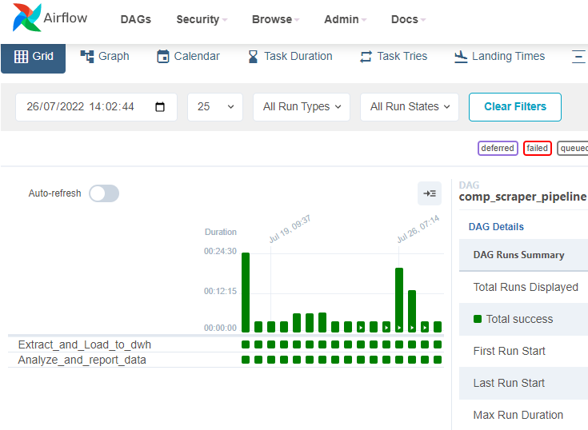

## AIRFLOW DOCKER PROJECT FOR DATA ENGINEERING/ANALYTICS

-This Repository Contains a skeletal Airflow DAG setup used to execute some of my personalized workflows.
- Sensitive Data Has been excluded.
- At the high end of this project, it extracts `Json` data from a couple of `APIs`, stages it, performs some slight transformation, and analytics and triggers mails on events to relevant stakeholders. We can call this an **`ETLAA*`** project _(Extract, Transform, Load, Analyze, Act)_ as that is what it achieves, beyond **`ETL`**.
- The relevant callables have been imported from the main script that triggeres over 7 unit operations. Therefore, although thi DAG shows up with two tasks, it actually runs 10 Unit operations.
- Building this docker image with `docker-compose build` should work if one already has an existing airflow installation (to install some additional dependencies.).

## **RUN Preview**

### **Preview of Dag Run in Airflow Tree View**

### **Preview of Dag Run (summarized) in Airflow Graph View**

- To include Later
    - Git Actions and Unit Tests for CI/CD/ DataOps.